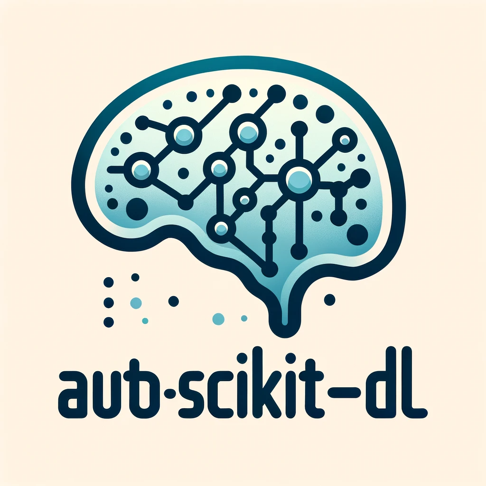

<div align="center"></div>

# Auto-Scikit-DL: An automatic deep tabular learning package

*Auto-Scikit-DL* is a deep tabular learning package served as a complement to scikit-learn. It will contain classical and advanced deep model baselines in tabular (machine) learning, automatic feature engineering and model selection methods, flexible training paradigm customization. This project aims to provide unified baseline interface and benchmark usage for the academic community, convenient pipeline construction for the machine learning competition, and rapid engineering experiment for machine learning projects, helping people focus on the specific algorithm design.

It is currently under construction by [LionSenSei](https://github.com/jyansir). More baselines are coming soon. The project will be packaged for public use in the future. If there are any problems or suggestions, feel free to contact [jyansir@zju.edu.cn]().


## Baselines

Here is the baseline list we are going to include in this package (continue to update):

| Paper                                                          | Baseline | Year  | Link |
| :------------------------------------------------------------- | :------- | :---: | :--- |
| AutoInt: Automatic Feature Interaction Learning via<br> Self-Attentive Neural Networks | AutoInt | 2019 | [arXiv](https://arxiv.org/abs/1810.11921) |
| Neural Oblivious Decision Ensembles for Deep Learning on Tabular Data | NODE | 2019 | [arXiv](https://arxiv.org/abs/1909.06312) |
| DCN V2: Improved Deep & Cross Network and Practical Lessons<br> for Web-scale Learning to Rank Systems | DCNv2 | 2020 | [arXiv](https://arxiv.org/abs/2008.13535) |
| TabNet: Attentive Interpretable Tabular Learning | TabNet | 2020 | [arXiv](https://arxiv.org/abs/1908.07442) |
| Contrastive Mixup: Self- and Semi-Supervised learning for Tabular Domain | VIME | 2021 | [arXiv](https://arxiv.org/abs/2108.12296) |
| Revisiting Deep Learning Models for Tabular Data | FT-Transformer | 2021 | [arXiv](https://arxiv.org/abs/2106.11959) |
| Saint: Improved neural networks for tabular data via<br> row attention and contrastive pre-training | SAINT | 2021 | [arXiv](https://arxiv.org/abs/2106.01342) |
| T2G-Former: Organizing Tabular Features into Relation Graphs<br> Promotes Heterogeneous Feature Interaction | T2G-Former | 2022 | [arXiv](https://arxiv.org/abs/2211.16887) |
| TabPFN: A Transformer That Solves Small Tabular Classification<br> Problems in a Second | TabPFN | 2022 | [arXiv](https://arxiv.org/abs/2207.01848) |
| ExcelFormer: A Neural Network Surpassing GBDTs on Tabular Data | ExcelFormer | 2023 | [arXiv](https://arxiv.org/abs/2301.02819) |


## Basic Framework

The project is organized into serveral parts:

- `data`: to include in-built dataset and benchmark files, store dataset global settings and infomation, and common data preprocessing scripts.

- `models`: to include baseline implementations, and contains an abstract class `TabModel` to organize the uniform deep tabular model interface and training paradigm.

- `configs`: to include default hyper-parameter and hyper-parameter search spaces of baselines in the original paper.

- `utils`: to include basic functionalities of: `model`, building baselines, tunning; `deep`, common deep learning functions and opitmizers; `metrics`, metric calculation.

## Examples

Some basic usage examples are provided in `examples` directory, you can run the scripts with `python examples/script_name.py`. Before run the examples, you can download our preprared in-built datasets in the [T2G-Former](https://arxiv.org/abs/2211.16887) experiment from this [link](https://drive.google.com/uc?export=download&id=1dIp78bZo0I0TJATmZKzBhrbZxFVzJYLR), then extract to `data/datasets` folder.

```
tar -zxvf t2g-data0.tar.gz -C ./data/datasets
```

- **Add a custom dataset from a single csv file**: If you want to load a csv file like in-built datasets, we provide the interface to automatically process from a raw csv file and store it in the package. Then you can load it easily.

- **Finetune a baseline**: You can easily finetune a model by our `fit` and `predict` APIs.

- **Tune a baseline**: We provide an end-to-end `tune` function to perform hyper-parameter search in spaces defined in `configs`. You can also define your own search spaces (refer to our config files).

## Add your models

Currently, you can only achieve this by manually copying your model codes and integrating it into the `models` folder (refer to `models/mlp.py` for API alignment, we suggest to copy it and directly add your model codes). Then modify `MODEL_CARDS` in `utils/model.py` to add and import your model. We will support adding user models with simple scripts in the future.

